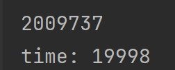
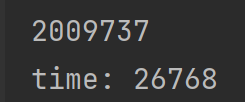
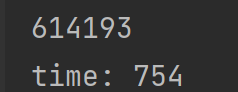

# Index Manager

## IndexManager

已经测试B+树的插入和删除，查找暂时没有，查找不涉及树的修改，应该不会错。

m<=4，即节点内允许只有1个值的时候，删除可能有问题？但是这里m最小也有15(255字节字符串索引)，所以没什么问题

~~**测试中的$10^5$数据，为char(128)建索引，测试时使用无限内存池都跑了二十几秒，进行了200万次fetchPage**~~





~~反正长字符串索引效率极差~~

以上都是胡扯，debug的时候在计算阶数那加了个return 4忘了删

```cpp
int BpTreeNode::maxKeyCount() const {
    return 4;
    if (header.keySize <= 0) return MAXKEYS;
    return (PAGESIZE - (int) sizeof(header)) / header.keySize - 1;
}
```

实际$10^5$个char(128)建立索引需要1.784秒，进行了90万次fetchPage

int类型用了0.754秒，61万次fetchPage



**这里的fetchPage全部是从内存中取，相当于无限大小缓存池**

```cpp
    /*
     * 为tableName表的属性attrName建立名为indexName的索引
     * 保存文件名为'{tableName}_{indexName}'
     * 获取包含所有条目的vector，然后通过这个vector建立B+树
     * 返回创建成功
     * 如果已经有了不能重复创建
     */
    bool createIndex(const std::string &tableName, const std::string &indexName,
                     const std::string &attrName);


    /*
     * 删除tableName表的indexName属性
     */
    bool dropIndex(const std::string &tableName, const std::string &indexName);

    /*
     * 在表table的索引index中插入一条，
     * 返回插入成功
     */
    bool insert(const std::string &tableName, const std::string &indexName,
                const Data &data, Position position);

    /*
     * 删除索引
     * record删除记录的时候顺带用这个把索引删了
     */
    bool remove(const std::string &tableName, const std::string &indexName,
                const Data &data);

    /*
     * 查找
     * left和right的type<-1或者>255就是没有限制
     * 俩都没有就不反回了
     * 左右都是闭区间！！！！！返回之后还要再处理
     * 非unique的时候<=可能出错！！！
     * 不过测试数据里面没有
     */
    std::vector<Position>
    search(const string &tableName, const string &indexName,
           const Data &left, const Data &right);

    std::vector<Position>
    search(const string &tableName, const string &indexName,
           const Data &equal);

```


## B+ Tree

一颗B+ Tree是一个索引

B+ Tree中的一个Node在文件中储存为1 Page（4K Bytes）

BpKey表示键值对，对于nonleaf node，BpKey中的Position只用到pageID，不用offset，此时作为page指针使用

对于leaf node，Position指示该条目在record中的储存位置。

### 储存方式

#### BpTreeHeader

索引文件的第0页储存索引信息

```cpp
struct BpTreeHeader {
    // 保存在文件
    int nodeCount, keySize; // 4+4 Bytes
    KeyType keyType; // 4 Bytes
    PageIndex rootPage; // 4 Bytes
};
```


#### BpTreeNodeHeader

Page中首先有一个Header，接下来是键值对，即BpKey

- Header: 28 Bytes
    - pageIndex: 4 Bytes  
      自身位置
    - keyCount, keySize: 4+4 = 8 Bytes  
      此Node中key的数量，以及单个key的大小
    - keyType: 4 Byte  
      key的类型
    - parent, sibling: 4+4 = 8 Bytes  
      父亲，兄弟的指针
    - isLeaf: 4 Byte（内存对齐，整个header一起读写）  
      标识叶节点
- keys: 4K-28 = 4068 Bytes at most  
  Node中储存的key，最多占用剩余的4068 Bytes

```cpp
struct BpTreeNodeHeader {
    PageIndex pageIndex;
    int keyCount, keySize;
    KeyType keyType;
    PageIndex parent, leftSibling, rightSibling;
    bool isLeaf;
};
```

